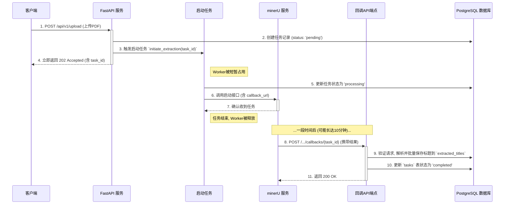

# PDF 标题提取服务 (PDF Title Extraction Service)

[](https://shields.io/)
[](https://shields.io/)
[](https://shields.io/)

一个基于FastAPI和Celery构建的高性能、可扩展的后端服务，用于从PDF文件中异步提取标题。

---

## 概述

本项目是一个纯后端的Web服务，旨在提供一个通过API接口异步提取PDF文件标题的功能。用户上传PDF文件后，系统会立即返回一个任务ID，并通过消息队列将耗时的解析任务分发给后台的Worker进行处理。系统采用
**回调模式**与第三方解析服务(`minerU`)进行通信，以最高效的方式处理长耗时任务，确保了服务的快速响应和健壮性。

### 关键特性

- **完全异步**: 基于FastAPI和Celery，实现请求与处理的完全解耦。
- **高可扩展**: Worker服务可以水平扩展，以应对高并发的解析请求。
- **回调模式**: 采用最高效的Webhook回调模式处理长耗时任务，避免了不必要的轮询。
- **生产就绪**: 使用Docker进行容器化部署，包含完整的日志、配置和错误处理机制。
- **现代技术栈**: 采用Python 3.12+、FastAPI、Pydantic、SQLAlchemy等现代Python技术。

## 系统架构

系统采用“启动-回调”模式来处理对第三方`minerU`服务的长耗时调用。此模式效率最高，但前提是`minerU`服务支持Webhook回调。



## 技术栈

| 组件 | 技术 |
| :--- | :--- |
| **Web框架** | FastAPI |
| **异步任务队列** | Celery |
| **消息中间件** | RabbitMQ |
| **数据库** | PostgreSQL |
| **数据模型/验证** | Pydantic, SQLAlchemy |
| **部署方案** | Docker, Docker Compose |
| **依赖管理** | UV, pyproject.toml |

## API 端点

### `POST /api/v1/upload`

上传一个PDF文件以启动标题提取任务。

- **请求**: `multipart/form-data`
- **表单字段**: `file` (PDF文件)
- **成功响应 (202 Accepted)**:
  ```json
  {
    "task_id": "a1b2c3d4-e5f6-7890-1234-567890abcdef",
    "status": "pending"
  }
  ```

### `GET /api/v1/tasks/{task_id}`

查询指定任务的当前状态和结果。

- **路径参数**: `task_id` (UUID)
- **成功响应 (200 OK)**:
  ```json
  {
    "task_id": "a1b2c3d4-e5f6-7890-1234-567890abcdef",
    "status": "completed",
    "filename": "my_document.pdf",
    "titles": [
      { "text": "第一章 介绍", "level": 1 },
      { "text": "1.1 背景", "level": 2 }
    ]
  }
  ```

## 快速开始

### 前提条件

- [Docker](https://www.docker.com/get-started)
- [Docker Compose](https://docs.docker.com/compose/install/)

### 安装与配置

1. **克隆代码仓库**
   ```bash
   git clone <your-repository-url>
   cd pdf-extractor-service
   ```

2. **创建环境变量文件**
   复制`.env.example`文件并重命名为`.env`。
   ```bash
   cp .env.example .env
   ```

3. **编辑`.env`文件**
   根据您的环境修改文件中的配置，特别是数据库凭据、服务URL和回调安全令牌。

   ```ini
   # .env

   # PostgreSQL 配置
   POSTGRES_SERVER=db
   POSTGRES_USER=myuser
   POSTGRES_PASSWORD=mypassword
   POSTGRES_DB=pdf_extractor_db

   # RabbitMQ 配置
   RABBITMQ_DEFAULT_USER=rabbit_user
   RABBITMQ_DEFAULT_PASS=rabbit_pass

   # 应用配置
   BASE_URL=http://localhost:8000
   MINERU_SERVICE_URL=http://<minerU-service-address>

   # 安全配置
   CALLBACK_TOKEN=a_very_secret_and_long_token_string
   ```

### 运行应用

使用Docker Compose启动所有服务（API, Worker, PostgreSQL, RabbitMQ）。

```bash
docker-compose up --build -d
```

服务启动后：

- API服务将在 `http://localhost:8000` 上可用。
- RabbitMQ管理后台将在 `http://localhost:15672` 上可用。

## 使用示例

### 1. 提交一个PDF文件

使用`curl`或其他API工具向`upload`端点发送一个POST请求。

```bash
curl -X POST -F "file=@/path/to/your/document.pdf" http://localhost:8000/api/v1/upload
```

复制返回的`task_id`。

### 2. 查询任务结果

在`minerU`服务完成处理并回调后，您可以使用`task_id`查询结果。

```bash
curl http://localhost:8000/api/v1/tasks/<your_task_id>
```

## 项目结构

```
pdf-extractor-service/
├── pyproject.toml        # 项目依赖与元数据
├── docker-compose.yml    # 服务编排
├── Dockerfile.api        # API服务容器定义
├── Dockerfile.worker     # Worker服务容器定义
├── .env                  # 环境变量
└─src/
    └─pdf_extractor/
        ├── api/          # API路由层
        ├── core/         # 核心配置与工具
        ├── crud/         # 数据库操作层
        ├── db/           # ORM模型与会话
        ├── schemas/      # Pydantic数据模型
        ├── services/     # 业务逻辑服务
        └── worker/       # Celery异步任务
```